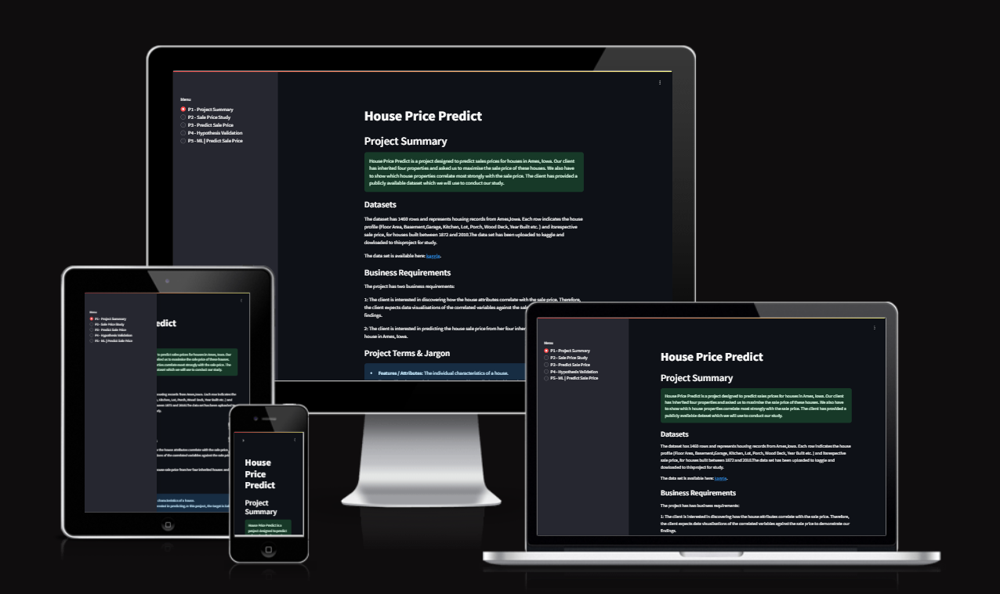
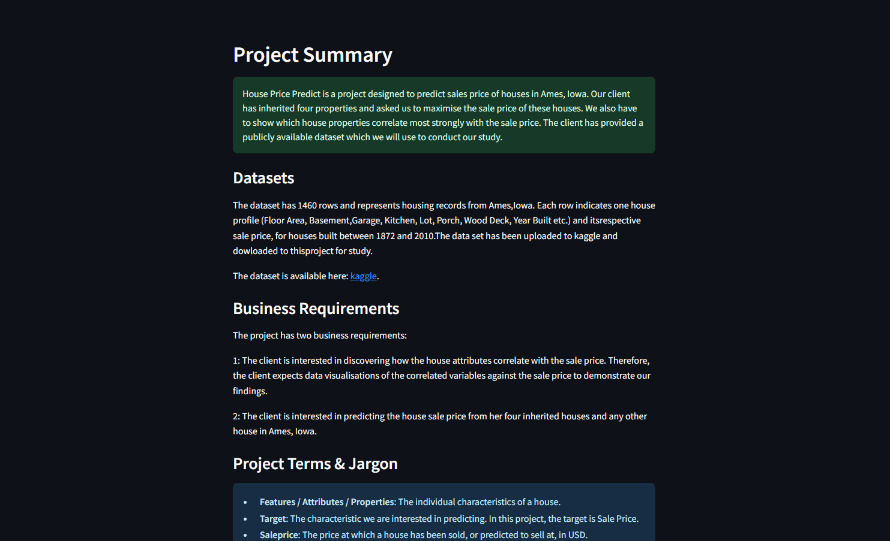
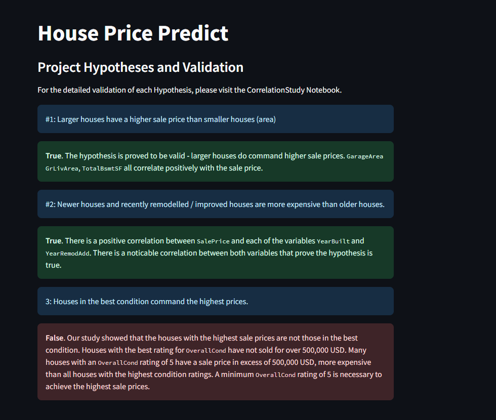
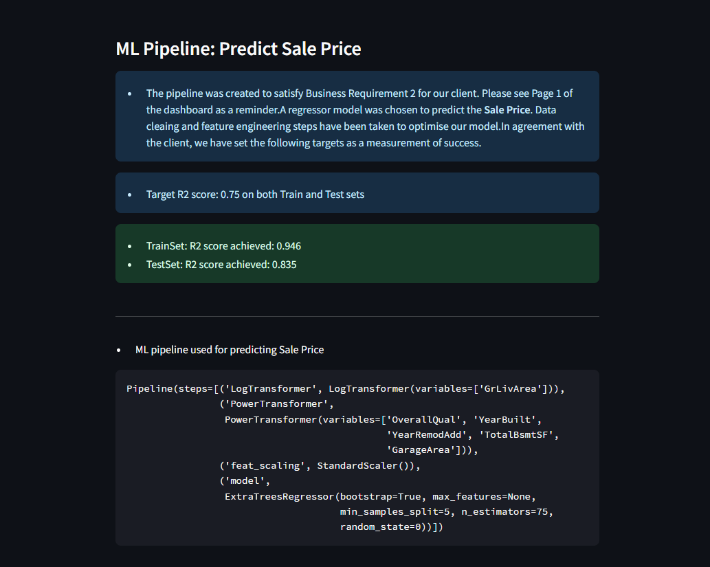

# House Prices ML

Click [here](https://house-prices-ml.onrender.com/) to view the live site.
Please note: As the site is hosted on Render it can take a couple of minutes
to load the page.

# Overview

This House-Price project utilises machine learning to build a functional data 
app for predicting the Sale Price of a house, presented on an interactive 
Streamlit dashboard, hosted on Rendor. The project is for educational purposes 
only and includes usage of Machine Learning Python Packages, Data analysis, 
Data visualisation tools, and Streamlit. 

The project was designed to help a client maximise the sale prices of houses 
they have inherited in Ames, Iowa. To achieve this, the client has provided a 
dataset that contains historical house sale prices and associated features of 
each property. The project goals are to identify the expected sale price for 
these homes and to analyse how specific property features influence the price. 

To ensure a structured and systematic approach, the project follows the Cross 
Industry Standard Process for Data Mining (CRISP-DM). This six-phase 
methodology provides a comprehensive framework for navigating the data science 
life cycle, from understanding the business problem to delivering actionable 
insights.

This was my fifth Milestone project with Code Institute and focusses not only 
on the code and presentation of the application, but the logic behind the 
analysis and interpretation of the data.

## Dataset Content

* The dataset is sourced from [Kaggle](https://www.kaggle.com/codeinstitute/housing-prices-data). 
* The dataset has almost 1.5 thousand rows and represents housing records from Ames, Iowa, indicating house profile (Floor Area, Basement, Garage, Kitchen, Lot, Porch, Wood Deck, Year Built) and its respective sale price for houses built between 1872 and 2010.

|Variable|Meaning|Units|
|:----|:----|:----|
|1stFlrSF|First Floor square feet|334 - 4692|
|2ndFlrSF|Second-floor square feet|0 - 2065|
|BedroomAbvGr|Bedrooms above grade (does NOT include basement bedrooms)|0 - 8|
|BsmtExposure|Refers to walkout or garden level walls|Gd: Good Exposure; Av: Average Exposure; Mn: Minimum Exposure; No: No Exposure; None: No Basement|
|BsmtFinType1|Rating of basement finished area|GLQ: Good Living Quarters; ALQ: Average Living Quarters; BLQ: Below Average Living Quarters; Rec: Average Rec Room; LwQ: Low Quality; Unf: Unfinshed; None: No Basement|
|BsmtFinSF1|Type 1 finished square feet|0 - 5644|
|BsmtUnfSF|Unfinished square feet of basement area|0 - 2336|
|TotalBsmtSF|Total square feet of basement area|0 - 6110|
|GarageArea|Size of garage in square feet|0 - 1418|
|GarageFinish|Interior finish of the garage|Fin: Finished; RFn: Rough Finished; Unf: Unfinished; None: No Garage|
|GarageYrBlt|Year garage was built|1900 - 2010|
|GrLivArea|Above grade (ground) living area square feet|334 - 5642|
|KitchenQual|Kitchen quality|Ex: Excellent; Gd: Good; TA: Typical/Average; Fa: Fair; Po: Poor|
|LotArea| Lot size in square feet|1300 - 215245|
|LotFrontage| Linear feet of street connected to property|21 - 313|
|MasVnrArea|Masonry veneer area in square feet|0 - 1600|
|EnclosedPorch|Enclosed porch area in square feet|0 - 286|
|OpenPorchSF|Open porch area in square feet|0 - 547|
|OverallCond|Rates the overall condition of the house|10: Very Excellent; 9: Excellent; 8: Very Good; 7: Good; 6: Above Average; 5: Average; 4: Below Average; 3: Fair; 2: Poor; 1: Very Poor|
|OverallQual|Rates the overall material and finish of the house|10: Very Excellent; 9: Excellent; 8: Very Good; 7: Good; 6: Above Average; 5: Average; 4: Below Average; 3: Fair; 2: Poor; 1: Very Poor|
|WoodDeckSF|Wood deck area in square feet|0 - 736|
|YearBuilt|Original construction date|1872 - 2010|
|YearRemodAdd|Remodel date (same as construction date if no remodelling or additions)|1950 - 2010|
|SalePrice|Sale Price|34900 - 755000|

## Business Requirements

You are requested by your friend, who has received an inheritance from a deceased great-grandfather located in Ames, Iowa, to  help in maximising the sales price for the inherited properties.

Although your friend has an excellent understanding of property prices in her own state and residential area, she fears that basing her estimates for property worth on her current knowledge might lead to inaccurate appraisals. What makes a house desirable and valuable where she comes from might not be the same in Ames, Iowa. She found a public dataset with house prices for Ames, Iowa, and will provide you with that.

* 1 - The client is interested in discovering how the house attributes correlate with the sale price. Therefore, the client expects data visualisations of the correlated variables against the sale price to show that.
* 2 - The client is interested in predicting the house sale price from her four inherited houses and any other house in Ames, Iowa.

## Hypothesis and how to validate?

### Hypothesis 1

Larger houses have a higher sale price than smaller houses (area).
* A correlation study is required to test this hypothesis

### Hypothesis 2

Newer houses, or recently remodelled houses are more expensive than older 
houses.
* A correlation study is required to test this hypothesis

### Hypothesis 3

Houses in the best condition command the highest prices.
* A correlation study is required to test this hypothesis

## Rationale to map the business requirements to the data visualizations and Machine Learning task

### Business Requirement 1: Data Visualization and Correlation Study
  - We will load, inspect, evaluate, clean and feature engineer the data related to the houses provided by the client.
  - We will conduct a correlation study to understand how each variable correlates with Sale Price of a house.
  - We will use the visual representations of the data to test our hypotheses and fulfill the business requirements.
For more information, please visit the "CorrelationStudy" notebook.

### Business Requirement 2: Regression Pipeline
  - We want to be able to predict the sale price of the 4 inherited houses for our client, and any other house in Ames, Iowa.
  - We will identify the data variables (property attributes) necessary to make a prediction about the sale price.
  - We will run a regression model to predict the sale price from the selected variables.
  - We will clean and feature engineer the data to prepare it for machine learning. 
  - We obtain the R2 score and Mean Absolute Error.

## ML Business Case
  - We need to implement an ML model to predict the sale price of a house. Data analytics alone will not be sufficient to meet the business requirements. As the target variable (SalePrice) is a continuous numeric value, we will use a Regression Model.
  - The target variable is already identified so the model will be supervised.
  - As agreed with the client, model success will be defined by an R2 score of at least 0.7 on the Train and Test Set.
  - The ML model will be considered expired if after a period of 12 months the models predictions are more than 40% different from the actual sale price, on more than 30% of predictions.
  - The ML model should predict the sale price in USD if all necessary input variables (house attributes) are provided.
  - The client will be provided with an interactive dashboard which will faciliate the sale pice predictions of all houses in Ames, Iowa (including the inherited ones).

___________________________
  

## Dashboard Design

### Page 1 | Project Summary
* Explain the project, terms & jargon
* Describe Project Dataset
* State Business Requirements

### Page 2 | Sale Price Study
* Satisfy Business Requirement 1

### Page 3 | Sale Price Predictor
* Satisfy Business Requirement 2
* Display predicted `SalePrice` for the 4 inherited houses.
* Allow user to input property data to predict `SalePrice' of any house.
* "Run Predictive Analysis" button passes user data into the ML pipeline
* Predicted `SalePrice` is displayed to the user.

### Page 4 | Hypothesesis - Testing and Validation

### Page 5 | ML Pipeline

___________________________
  
## Deployment

### Deployment To Render

#### Create a Render Account
1. Go to [Render.com](https://render.com/)
2. Sign up for Render with GitHub
3. Log into GitHub and then select “Authorize Render”
4. Confirm your email address and click “Complete sign up”
5. Open your email account and click the email verification link

#### Connect Render to your GitHub repositories
1. Click “New +” and select “Web Service”
2. On the right of the page, select “+ Connect account” for GitHub
3. Select your GitHub account
4. Select the required repository / repositories.

Once your repo is connected, there are a series of configuration settings required.
Watch the console for some activity, deployment can take up to 15 minutes to complete

#### Settings

1. Choose unique name for the project. If the name is unique on Render.com, 
the resulting URL will be <name>.onrender.com.
2. Ensure the following settings match
- Root Directory: Blank
- Environment: Python 3
- Branch: Main
3. Set the Build Command: `pip install -r requirements.txt && ./setup.sh`
4. Set the Start Command: `streamlit run app.py`

#### Environment Variables

1. Scroll down and click 'Advanced'
2. Click "Add Environment Variable"
3. Add a key: "PORT" with a value "8501"
4. Add a key: "PYTHON_VERSION" with a value "3.12.1"
5. Allow "Auto Deploy"
6. Click “Create Web Service”

The site will deploy every time a commit is pushed to the GitHub repository

Additional documentation for this process can be found [here](https://code-institute-students.github.io/deployment-docs/42-pp5-pa/_)

### Forking the GitHub Repository

By forking the GitHub Repository you will be able to make a copy of the original repository on your own GitHub account allowing you to view and/or make changes without affecting the original repository by using the following steps:

1. Log in to GitHub and locate the [GitHub Repository](https://github.com/bmays9/house-prices-ml)
2. At the top of the Repository just above the "Settings" button on the menu, locate the "Fork" button.
3. You should now have a copy of the original repository in your GitHub account.

### Making a Local Clone

1. Log in to GitHub and locate the [GitHub Repository](https://github.com/bmays9/house-prices-ml)
2. Under the repository name, click "Clone or download".
3. To clone the repository using HTTPS, under "Clone with HTTPS", copy the link.
4. Open command line interface on your computer
5. Change the current working directory to the location where you want the cloned directory to be made.
6. Type `git clone`, and then paste the URL you copied in Step 3.

___________________________
  
## Main Data Analysis and Machine Learning Libraries

GitHub: This was used for version control and the codespace was used as the IDE.

GitHub Projects: This was used for User Story tracking and the Kanban board.

NumPy: Used to process arrays and the store the values.

Pandas: We used this for data analysis and visualisations.

Matplotlib: This was used for generating graphs for data visualisation.

ML-Scikit-learn: This was used for ML pipeline creation.

Seaborn: Used for data visualisations.

Streamlit: This is what we used to create the dashboard that is presented to 
the client for use.

ML-Feature-engine: This was used to engineer the data for the ML Pipeline.

Kaggle: This was the site used to download the initial dataset provided by the client. 

Python: The main programming language used for this project.

Render: Used to host the live dashboard to present to the client. 

___________________________
  
## Bugs

#### When attempting to run the first prediction on the dashboard I encountered the error.

This was found to be due to the ML pipeline being created using all 23 variables as input. 
On the dashboard, only the 6 user inputted (best features) were being fed to the pipeline.
I decided to refit the pipeline using only the best features. In choosing to use 6 features,
I was able to refit the model without a noticeable drop in performance.

#### When attempting to run the first prediction on the dashboard I encountered the error.

Once the number of inputs was resolved I received a new error. The calculation was not
possible as I was providing a String input on the 'OverallCond' variable. This was because
I has configured the widget to use a drop-down selection of numbers (0-10), but the value
passed to the pipeline was in string format. To correct this I changed the widget type to
a numeric input.

#### When deploying to Render, I experienced an error 'No module named 'pkg_resources'

To correct this, I added a new line to the Requirements.txt file to specify the version
of setuptools (75.6.0). Once I deployed again after this change there was no error.

___________________________
  
## Credits

* The Code Institute Churnometer project was a valuable resource to use as 
the building blocks and structure for this project.

## Acknowledgements

* I would like to thank my family for all their support throughout this 
project.
* I must also thank Darragh Drennan and Ronan Rakic who provided valuable
help and support via Slack when it was needed.
